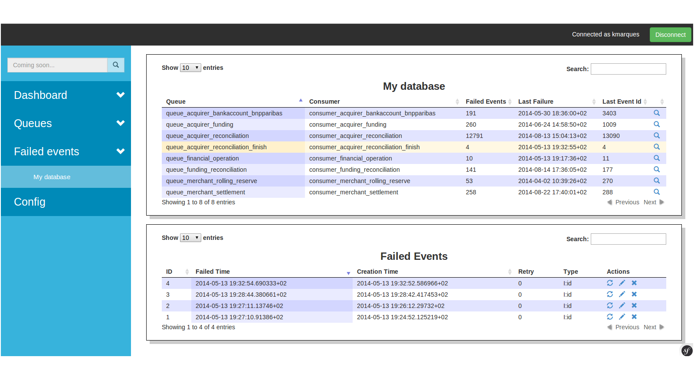

# PGQManager

A PHP based web application in order to manage [PGQ Skytools] (http://wiki.postgresql.org/wiki/Skytools)

## Table of Contents
  * [Change log](#change-log)
  * [Requirements](#requirements)
  * [Installation](#installation)
  * [Contributions](#contributions)
  * [Versioning](#versioning)
  * [Git branching model](#git-branching-model)
  * [Copyrights & licensing](#copyrights--licensing)

## Change log
See [CHANGELOG](CHANGELOG.md) file for details.

## Requirements
 * Nodejs/npm : mandatory to install the less compiler
 * Lessc : compile less files to css (npm package)
 * LDAP server : the application use a LDAP connection to authenticate users.
 * Skytools 2.x : the application was tested only with skytools 2.
 * Skytools extension : [Hi-Media/skytools-sql](https://github.com/Hi-Media/skytools-sql) the application use this extension for failed events stats.

## Installation
 1. `git clone https://github.com/Hi-Media/****.git`
 2. `composer install`
 3. Go to `http://localhost/config.php` or execute `php app/check.php` in order to check requirements

## Contributions
All suggestions for improvement or direct contributions are very welcome.
Please report bugs or ask questions using the [Issue Tracker](https://github.com/Hi-Media/****/issues).

## Versioning
For transparency into our release cycle and in striving to maintain backward compatibility,
PGQManager is maintained under [the Semantic Versioning guidelines](http://semver.org/).
We'll adhere to these rules whenever possible.

## Git branching model
The git branching model used for development is the one described and assisted by `twgit` tool: [here](https://github.com/Twenga/twgit).

## Screenshots

##### Failed Events Monitor

## Copyrights & licensing
Licensed under the Apache License 2.0.
See [LICENSE](LICENSE) file for details.